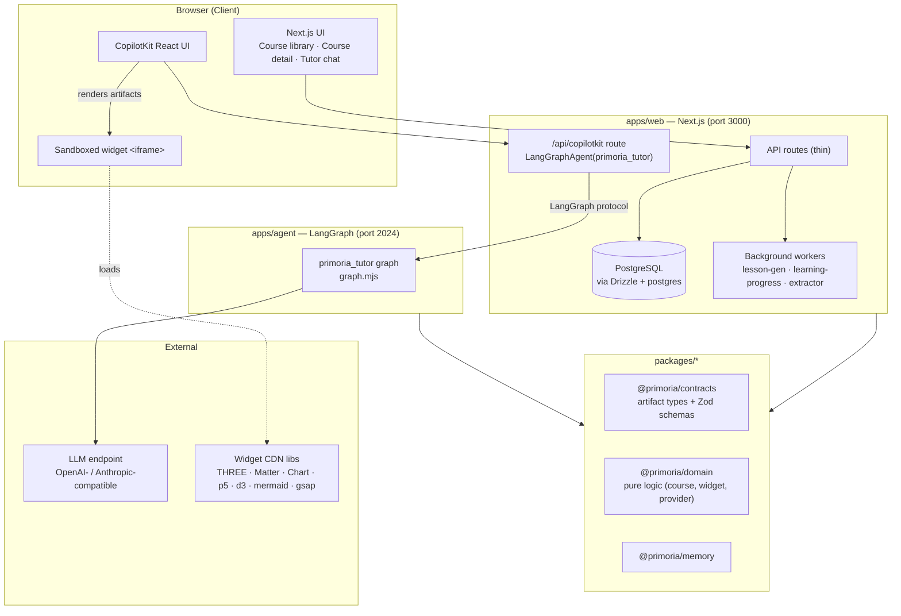
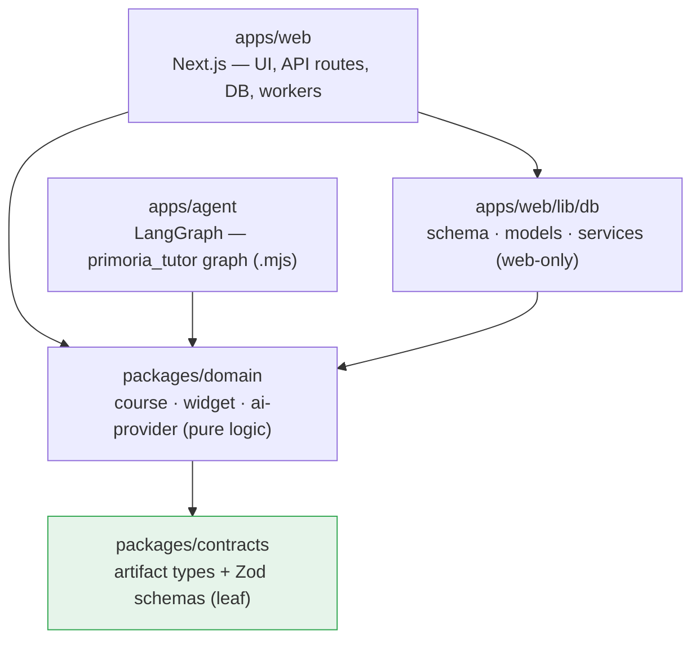
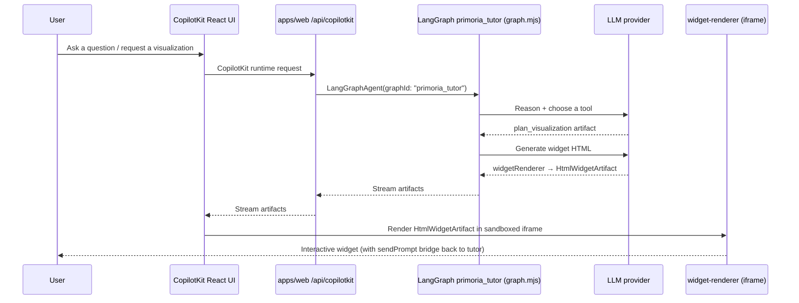
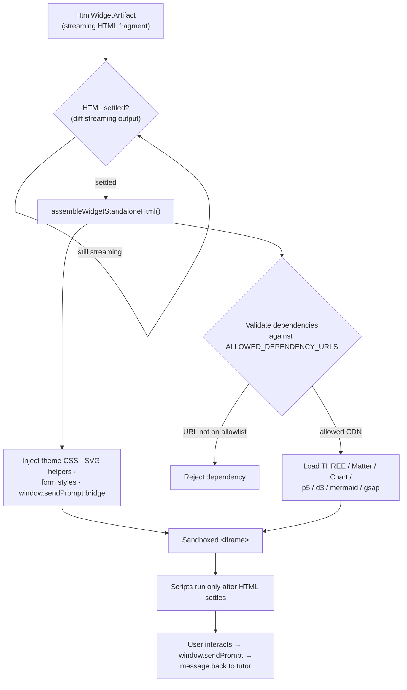
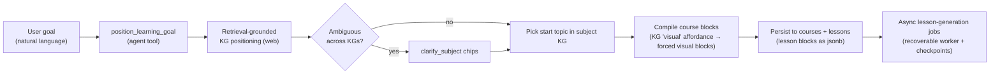
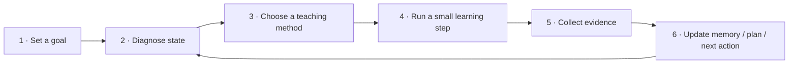
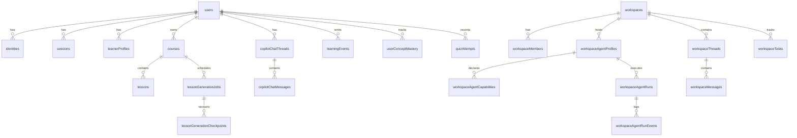
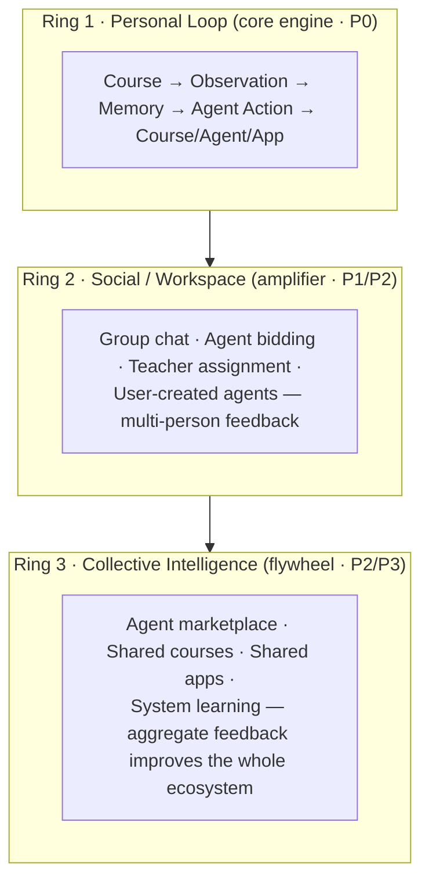

# Primoria — Project Report

> An AI-native learning workspace for adaptive, long-horizon education.

| | |
| --- | --- |
| **Project name** | Primoria |
| **Repository** | https://github.com/junjiezhou1122/primoria |
| **University** | *[University Name]* |
| **Department / School** | *[Department / School]* |
| **Program / Degree** | *[Program / Degree]* |
| **Course / Module** | *[Course / Module code and title]* |
| **Author(s)** | *[Student name(s) and ID(s)]* |
| **Supervisor** | *[Supervisor name]* |
| **Date** | *[Submission date]* |

---

## Table of contents

1. [University introduction](#1-university-introduction)
2. [Project background](#2-project-background)
3. [Technical implementation](#3-technical-implementation)
   - [3.1 System overview](#31-system-overview)
   - [3.2 Repository topology](#32-repository-topology)
   - [3.3 The AI Tutor runtime path](#33-the-ai-tutor-runtime-path)
   - [3.4 Agent tool pipeline & artifacts](#34-agent-tool-pipeline--artifacts)
   - [3.5 Sandboxed widget rendering](#35-sandboxed-widget-rendering)
   - [3.6 Course generation & knowledge graph positioning](#36-course-generation--knowledge-graph-positioning)
   - [3.7 Long-horizon learning loop](#37-long-horizon-learning-loop)
   - [3.8 Data model](#38-data-model)
   - [3.9 Model provider abstraction](#39-model-provider-abstraction)
   - [3.10 Technology stack](#310-technology-stack)
   - [3.11 Product architecture — the three rings](#311-product-architecture--the-three-rings)
4. [Engineering practices](#4-engineering-practices)
5. [Current status & roadmap](#5-current-status--roadmap)
6. [Appendix: screenshots](#6-appendix-screenshots)

---

## 1. University introduction

> *This section is written with placeholders. Replace the bracketed fields with the
> real institutional details before submission.*

**[University Name]** is *[a short one-paragraph institutional profile — founding
year, location, ranking/reputation, and academic focus]*. This project was carried
out within the **[Department / School]**, whose research and teaching focus
includes *[e.g. computer science, software engineering, human–computer
interaction, artificial intelligence, and educational technology]*.

The work is submitted as part of **[Course / Module code and title]** in the
**[Program / Degree]** program, under the supervision of **[Supervisor name]**.
The department emphasizes *[e.g. project-based learning, applied research, and
industry-relevant software engineering]*, which directly motivated the choice of a
production-grade, full-stack, AI-native application as the project vehicle.

| Institutional detail | Value |
| --- | --- |
| University | *[University Name]* |
| Faculty / School | *[Faculty / School]* |
| Department | *[Department]* |
| Program | *[Program / Degree]* |
| Module | *[Module code and title]* |
| Academic year | *[YYYY–YYYY]* |
| Supervisor | *[Supervisor name]* |

---

## 2. Project background

### 2.1 Motivation

Most "AI education" tools today are **one-shot course generators** or thin chat
wrappers around a large language model. They produce a polished answer for a single
prompt and then forget everything. Real learning, however, is a **long-horizon
process**: it plays out across many sessions, and what a learner needs at any given
moment depends on evidence of their progress, confusion, recall, and fatigue.

Primoria is built around this thesis. As stated in the project's guiding document:

> *Primoria is not a one-shot course generator. Its main line is a long-horizon
> learning system that observes progress over time, adapts teaching methods
> dynamically, and uses evidence to decide what to do next.*

The product should therefore:

- track what the learner is trying to achieve;
- observe evidence of progress, confusion, recall, transfer, and fatigue;
- choose a teaching method that fits the current state;
- switch methods when the current one stops working;
- keep a history so future decisions are better than the last one.

### 2.2 Problem statement

For any learner at any moment, the system must give the teaching agent **enough
compressed context** to choose a useful next teaching action. The raw decision space
is combinatorial:

```
all possible actions =
  (which concept) × (which method) × (who teaches) × (when)
  × (what depth) × (what form) × (which goal scope) × (what feedback means)
```

Primoria's core research/engineering contribution is decomposing this into eight
independent, individually-compressible search spaces (knowledge, goal, learner
state, method, agent, timing, content, feedback), so the runtime acts over a
bounded state instead of the raw product.

### 2.3 What Primoria is

Primoria is an **AI-native learning workspace** that combines:

- **On-demand short courses** generated from a global knowledge graph;
- **Interactive learning widgets** — self-contained, sandboxed HTML/CSS/JS
  visualizations (physics scenes, algorithm animations, 3D scenes, charts,
  molecules, math explorers) generated by the AI Tutor;
- **Course-aware tutoring** via a CopilotKit + LangGraph agent;
- A foundation for **workspace / classroom collaboration** (teachers, students,
  assignments) and a future **multi-agent marketplace**.

### 2.4 Non-goals

Primoria is deliberately **not** *only* a course builder, a chat UI, a quiz engine,
or a static agent marketplace. Those are useful surfaces, but each is subordinate to
the long-horizon adaptive learning loop.

---

## 3. Technical implementation

> **Source code:** https://github.com/junjiezhou1122/primoria

### 3.1 System overview

Primoria is a **pnpm monorepo** with two runtime applications and a set of shared
packages. The web app owns all user-scoped learning logic, persistence, and UI; the
agent is a stateless positioning/conversation surface that renders artifacts back
into the UI.



### 3.2 Repository topology

The codebase follows a strict, one-way dependency law. `apps/web` (TypeScript) and
`apps/agent` (plain ESM `.mjs`) are **peers** — neither imports the other. Anything
they must share is extracted into `packages/*`, where `contracts` is a dependency-free
leaf and `domain` is pure logic with **zero framework dependency**.



**Design laws** (from `docs/architecture.md`):

1. A package boundary is a *cross-runtime sharing line* — code is extracted to
   `packages/*` only when both apps need it and cannot import each other.
2. Dependencies flow one way, never backward. A cycle means the design is wrong.
3. Domain logic has zero framework dependency (no Next.js, React, CopilotKit,
   LangGraph).
4. Contracts have a single source of truth — a schema is defined once and its type
   is derived via `z.infer`, so drift becomes impossible.

Directory layout:

```
primoria/
├─ apps/
│  ├─ web/      Next.js — UI, API routes, DB, CopilotKit integration, workers
│  └─ agent/    LangGraph agent — serves the primoria_tutor graph (plain ESM)
├─ packages/
│  ├─ contracts/  artifact types + Zod schemas (single source of truth)
│  ├─ domain/     pure logic shared across runtimes
│  └─ memory/     durable evidence/memory helpers
├─ temple/      knowledge-graph JSON (20+ subjects) + builders + validators
├─ docs/        architecture, product design, tech-stack, runbooks
└─ e2e/         end-to-end tests
```

### 3.3 The AI Tutor runtime path

There is exactly **one active tutor runtime path**. Legacy paths
(`/api/tutor/chat`, `tutor-agent.ts`, `primoria-deep-agent.ts`) are dead code and
not kept in sync.



### 3.4 Agent tool pipeline & artifacts

The agent (`apps/agent/src/graph.mjs`) exposes a rich toolset. The standard
visualization flow is **plan → render**:

1. `plan_visualization` — the model emits a `VisualizationPlanArtifact` (approach,
   technology, key elements).
2. `widgetRenderer` — the model writes a self-contained HTML/CSS/JS fragment →
   `HtmlWidgetArtifact`.

Beyond the generic widget renderer, the graph ships **typed STEM renderers** that
constrain generation to a schema for reliability:

```mermaid
flowchart LR
    LLM["primoria_tutor<br/>(LangGraph agent)"]

    subgraph Planning
        plan["plan_visualization"]
        pos["position_learning_goal"]
        card["get_course_card"]
    end

    subgraph Generic
        widget["widgetRenderer<br/>→ html_widget"]
    end

    subgraph "Typed STEM renderers"
        stem["stemRenderer"]
        chart["render_chart"]
        diagram["render_diagram"]
        physics["render_physics_scene"]
        algo["render_algorithm"]
        math["render_math_explorer"]
        wave["render_wave"]
        graph["render_graph"]
        mol["render_molecule"]
        three["render_3d_scene"]
        quiz["render_chat_quiz"]
    end

    LLM --> Planning
    LLM --> Generic
    LLM --> stem & chart & diagram & physics & algo & math & wave & graph & mol & three & quiz
```

**Artifact types** (`apps/web/src/lib/ai/types.ts`) form a discriminated union on
`type`, mirrored by Zod schemas in the contracts layer and in `graph.mjs`:

| Artifact type | Purpose |
| --- | --- |
| `html_widget` | Sandboxed iframe widget |
| `visualization_plan` | Planning card (collapses after the widget renders) |
| `code` | Code block |
| `course_card` | Links to a generated course |
| `todo_list` | Step tracker |
| `tool_status` | Transient executing / complete status |

Adding a new artifact type requires three coordinated changes: (1) the type in
`types.ts` / contracts, (2) a branch in `ToolCard`
(`apps/web/src/components/generative-ui/tool-card.tsx`), and (3) the schema in
`graph.mjs`.

### 3.5 Sandboxed widget rendering

Widgets are the product's signature feature: fully interactive visualizations
generated at runtime and executed safely in the browser. Rendering happens inside a
sandboxed `<iframe>` (`apps/web/src/components/generative-ui/widget-renderer.tsx`).



Key safety constraints:

- Widget HTML must be an **iframe fragment** (no `<html>/<head>/<body>` wrapper,
  no `100vh` layouts).
- External library URLs are validated against `ALLOWED_DEPENDENCY_URLS`; only CDN
  URLs on the allowlist load. The allowlist in `widget-renderer.tsx` and in
  `graph.mjs` must be kept in sync.
- Streaming HTML is diffed before execution; **scripts run only after the HTML has
  settled**, preventing partial-DOM crashes.
- Libraries are loaded from CDN at runtime, never installed as npm packages.

### 3.6 Course generation & knowledge graph positioning

Course creation begins with the `position_learning_goal` tool. The **web side**
performs global knowledge-graph (KG) positioning, course creation, and persistence —
consistent with the "web-as-brain" principle where user-scoped learning logic lives
in the web app and the agent stays stateless.



The knowledge graphs live in `temple/` as JSON (20+ subjects rewritten to a canonical
English schema — e.g. CIE for A-Level), built via `spec_*.py` + `kg_en_builder.py`
and gated by `validate_kg.py`. Course visuals are forced per-KG `visual` affordance
as a deterministic floor in the compiler, wiring `algorithm_visualizer` and
`math_explorer` engines into course blocks.

### 3.7 Long-horizon learning loop

The core of Primoria's product thesis is the **canonical adaptive loop**. Teaching
methods are treated as first-class strategy objects, each with a trigger, an output,
and a success signal.



Each course **block type** is the materialization of a teaching method — an *agent
action contract*, not a display format:

| Block type | Teaching intent | Trigger |
| --- | --- | --- |
| `explanation` | Direct exposition | Concept is new |
| `analogy` | Transfer via familiar domain | Abstract concept resists direct explanation |
| `visual` | Interactive visualization | Spatial/intuitive understanding needed |
| `worked_example` | Step-by-step solution | Understands but cannot yet do |
| `drill` | Retrieval practice / quiz | Needs memory consolidation |
| `socratic` | Guided questioning | Can reason but is uncertain |
| `transfer` | Cross-domain application | Cannot yet generalize |
| `project` | Applied task | Needs synthesis across concepts |
| `review` | Spaced repetition | Likely to forget (decay signal) |
| `reflection` | Metacognitive recap | End of a learning segment |

Evidence is captured in a **layered memory model** (System → User → Goal → Course →
Agent), where each layer answers a different question ("what works in the world",
"who is this person", "how is this person in this domain", "what should this course
teach next", "who should teach it"). The post-lesson adaptive loop (mastery update +
recommend-then-confirm next step) runs on its own recoverable job/worker.

### 3.8 Data model

Persistence is **Postgres-first and vendor-portable** (Supabase is the current shared
cloud provider). The ORM is Drizzle over the `postgres` driver; the schema lives in
`apps/web/src/lib/db/schema.ts`. The tables group into clear domains:



Table groups (40+ tables total):

| Domain | Representative tables |
| --- | --- |
| **Identity & auth** | `users`, `identities`, `sessions`, `otp_codes`, `user_settings` |
| **Learner profile** | `learnerProfiles`, `learnerFacts` |
| **Courses** | `courses`, `lessons`, `courseEditEvents` |
| **Lesson generation** | `lessonGenerationJobs`, `lessonGenerationCheckpoints` |
| **Tutor chat** | `copilotChatThreads`, `copilotChatMessages` |
| **Learning evidence** | `learningEvents`, `learningProgressJobs`, `userConceptMastery`, `quizAttempts` |
| **Media / extraction** | `mediaAssets`, `extractorJobs` |
| **Workspace / classroom** | `workspaces`, `workspaceMembers`, `workspaceThreads`, `workspaceMessages`, `workspaceTasks`, `workspaceArtifacts` |
| **Workspace agents** | `workspaceAgentProfiles`, `workspaceAgentCapabilities`, `workspaceAgentConnections`, `workspaceAgentRuns`, `workspaceAgentRunEvents`, `workspaceAgentApprovals`, `workspaceAgentMemories`, `workspaceAgentSkills`, `workspaceAgentSkillVersions` |

Lesson blocks are stored as `jsonb`. DB access is confined to `apps/web/` server-side
code; the agent never touches the database.

### 3.9 Model provider abstraction

The model provider is resolved from environment variables or per-request
`TutorProviderSettings` (`apps/web/src/lib/ai/deepagent/model.ts`). Two families are
supported behind one contract:

- `openai-compatible` (default) → `ChatOpenAI`
- `anthropic-compatible` → `ChatAnthropic`

```bash
# OpenAI-compatible
AI_PROVIDER=openai-compatible
OPENAI_BASE_URL=https://your-endpoint/v1
OPENAI_API_KEY=your-key
OPENAI_MODEL=gpt-5.4

# Anthropic-compatible
AI_PROVIDER=anthropic-compatible
ANTHROPIC_BASE_URL=https://your-endpoint
ANTHROPIC_API_KEY=your-key
ANTHROPIC_MODEL=your-model
```

This keeps the runtime **model-agnostic**: the same agent graph runs against any
compatible endpoint, which is important both for cost control and for portability.

### 3.10 Technology stack

| Layer | Technology |
| --- | --- |
| **Monorepo / tooling** | pnpm workspaces, TypeScript 5.7, tsx, Playwright |
| **Web app** | Next.js, React, Tailwind-style UI |
| **Tutor UI** | CopilotKit (`@copilotkit/react-core`, `react-ui`, `runtime`) |
| **Agent runtime** | LangGraph (`@langchain/langgraph`), LangChain, `deepagents` (plain ESM) |
| **LLM SDKs** | `@langchain/openai`, `@langchain/anthropic` |
| **Persistence** | PostgreSQL, Drizzle ORM, `postgres` driver, Supabase (cloud), `@langchain/langgraph-checkpoint-postgres` |
| **Rendering libs (CDN, runtime)** | THREE, Matter.js, Chart.js, p5, d3, mermaid, gsap, ECharts, KaTeX, mathjs, mind-elixir |
| **Docs / content parsing** | react-markdown, remark-gfm, remark-math, rehype-katex, mammoth, pdf-parse |
| **Validation / contracts** | Zod (single source of truth via `z.infer`) |
| **MCP** | `@langchain/mcp-adapters` |

### 3.11 Product architecture — the three rings

At the product level, Primoria is designed as three nested rings. Ring 1 is the
heart; Rings 2 and 3 are an amplifier and a flywheel built on top of it.



All observations flow through a single **event pipeline** into four engines
(Learning, Agent Routing, Content, Collective Intelligence) that drive one shared
agent pool (built-in + user-created agents).

---

## 4. Engineering practices

- **Single source of truth for contracts** — artifact schemas are defined once in
  Zod; TypeScript types are derived, eliminating a former three-way manual sync
  across the TS/mjs boundary.
- **Recoverable background jobs** — lesson generation, learning-progress
  orchestration, and content extraction each run on their own worker with
  job + checkpoint tables so they survive restarts.
- **Vendor portability** — application code depends on Primoria repositories rather
  than vendor-specific calls; Postgres/Supabase is swappable.
- **Tests without a heavy runner** — unit checks run directly via `tsx`/`node`;
  E2E checks (widget renderer, sediment) run against a live app; the agent graph is
  syntax-checked with `node --check apps/agent/src/graph.mjs`.
- **Branch-per-issue workflow** — no direct pushes to `main`; each issue gets a
  dedicated branch and PR with summary, screenshots, and testing notes.

```bash
# Install & run both web (3000) and agent (2024)
pnpm install
pnpm dev

# Quality gates
pnpm --filter @primoria/web typecheck
pnpm lint
pnpm build
node --check apps/agent/src/graph.mjs

# Database migrations after schema changes
pnpm --filter @primoria/web db:generate
pnpm --filter @primoria/web db:migrate
```

---

## 5. Current status & roadmap

**Implemented (P0 foundation):** monorepo + shared contracts/domain packages;
account creation and sessions; the CopilotKit + LangGraph tutor path; sandboxed
interactive widgets with typed STEM renderers; KG-driven course generation with
recoverable lesson-generation jobs; post-lesson learning-progress orchestration;
cloud Postgres persistence.

**In progress / planned:**

- Course tutor context and richer in-course actions
- Interactive widget stability and a React (non-iframe) renderer path
- Static image lesson blocks (Gemini-generated)
- Long-term memory / mem0-style integration
- Workspace communication for teachers, students, and homework
- Agent confidence model, bidding, and (later) a marketplace with feedback-driven
  ranking (Ring 2 → Ring 3)

---

## 6. Appendix: screenshots

> Images are stored in `docs/`. Paths below are relative to the repository root.

**Current web app**


**AI Tutor**


**Interactive widget in context**


**Settings / provider configuration**


**Concept designs (desktop / mobile)**


---

*Report generated for the Primoria project · Repository:
https://github.com/junjiezhou1122/primoria*
