# Primoria 参赛项目报告

> 面向自适应、长周期学习的 AI 原生学习工作台

| 项目字段 | 内容 |
| --- | --- |
| 项目名称 | Primoria |
| 项目类型 | AI 教育 / 自适应学习 / Agent 应用 |
| GitHub 仓库 | https://github.com/junjiezhou1122/primoria |
| 学校 | *[学校名称]* |
| 院系 / 学院 | *[院系 / 学院]* |
| 专业 / 学位 | *[专业 / 学位]* |
| 课程 / 模块 | *[课程 / 模块代码及名称]* |
| 作者 | *[学生姓名及学号]* |
| 指导老师 | *[指导老师姓名]* |
| 提交日期 | *[提交日期]* |

---

## 摘要

Primoria 是一个面向长期学习过程的 AI 原生学习系统。它不只是根据提示词生成一份课程，而是把用户的学习目标、知识图谱位置、概念掌握度、课内测验结果、学习事件和长期记忆整合到同一个闭环中，持续判断下一步应该教什么、怎么教、是否需要补救，以及哪些内容可以快速跳过。

项目采用 Next.js、React、CopilotKit、LangGraph、PostgreSQL、Drizzle ORM 和多学科知识图谱构建。系统支持自然语言学习目标定位、课程大纲生成、逐节 lesson 懒生成、交互式可视化 block、concept 级 quiz、学习证据采集、mastery 更新和补救 lesson 决策。相比普通 AI 聊天工具，Primoria 的重点是将大语言模型接入一个可观察、可恢复、可持续调整的学习系统。

**关键词：** AI 教育、自适应学习、知识图谱、AI Agent、LangGraph、CopilotKit、Next.js、PostgreSQL、交互式可视化

---

## 目录

1. [学校介绍](#1-学校介绍)
2. [项目背景](#2-项目背景)
3. [技术实现](#3-技术实现)
4. [项目创新点](#4-项目创新点)
5. [当前完成度与后续计划](#5-当前完成度与后续计划)
6. [附录：产品截图](#6-附录产品截图)

---

## 1. 学校介绍

> *本节为提交模板。正式提交前，请替换方括号中的学校、院系、课程和个人信息。*

**[学校名称]** 是 *[学校简介：可包括建校年份、所在地、办学特色、学术声誉、相关专业优势等]*。本项目由 **[院系 / 学院]** 的 **[专业 / 学位]** 学生完成，属于 **[课程 / 模块代码及名称]** 的项目成果，指导老师为 **[指导老师姓名]**。

本项目选题与人工智能、软件工程、人机交互和教育技术相关。项目目标不是完成一个静态演示页面，而是实现一个真实可运行的全栈 AI 应用：前端负责学习体验，后端负责课程生成和学习状态管理，Agent 负责工具调用和智能交互，数据库负责长期学习证据持久化。

| 学校信息 | 内容 |
| --- | --- |
| 学校 | *[学校名称]* |
| 学院 / 学部 | *[学院 / 学部]* |
| 院系 | *[院系]* |
| 专业 / 学位 | *[专业 / 学位]* |
| 课程模块 | *[模块代码及名称]* |
| 学年 | *[YYYY-YYYY]* |
| 指导老师 | *[指导老师姓名]* |

---

## 2. 项目背景

### 2.1 问题来源

目前很多 AI 教育产品仍停留在“一次性生成内容”的阶段。用户输入“我想学微积分”或“教我二分查找”，系统通常会立即生成一篇讲解、一组题目或一份课程大纲。但真实学习并不是一次性生成即可完成的过程。学习者会在不同概念上出现不同程度的理解偏差，也会在练习、提问、反馈和复习中不断暴露新的学习证据。

这类一次性工具主要存在四个问题：

| 问题 | 影响 |
| --- | --- |
| 缺少长期状态 | 系统不知道用户之前学过什么、哪里薄弱、偏好怎样的解释 |
| 缺少知识结构 | 课程路径容易由模型自由发挥，难以保证先修关系和学习顺序 |
| 缺少证据闭环 | quiz、对话反馈、学习完成情况没有真正影响下一步教学 |
| 缺少交互式体验 | 大量内容仍是静态文字，难以解释动态机制、变量关系和抽象过程 |

Primoria 正是针对这些问题设计的。它把课程生成、知识图谱、AI Tutor、学习证据和长期记忆放在同一个系统中，让 AI 不只是“回答问题”，而是持续参与学习过程的组织。

### 2.2 项目目标

Primoria 的目标是：为每个用户生成并维护一条贴合自身学习情况的自适应课程路径。

具体目标包括：

1. **学习目标定位**：用户用自然语言描述目标后，系统在多学科知识图谱中定位学科、topic 和起始概念。
2. **课程路径生成**：系统根据知识图谱顺序生成 Course 大纲，而不是完全依赖模型自由生成。
3. **逐节 Lesson 生成**：先生成第一节 lesson，其余 lesson 按学习进度懒生成，降低等待时间和无效生成成本。
4. **交互式学习内容**：在合适场景中生成 visual、image、quiz、code 等 block，提升理解抽象概念的能力。
5. **学习证据采集**：记录 quiz、lesson completion、定位结果、对话反馈等事件。
6. **概念掌握度更新**：维护 concept 级 mastery，用于判断快速复习、完整教学或补救。
7. **补救 Lesson 插入**：发现知识缺口时，系统在原学习路径中插入补救 lesson。
8. **长期记忆沉淀**：把碎片化学习事件异步蒸馏成用户画像和可检索的学习片段。

### 2.3 面向用户

Primoria 面向需要系统性学习复杂知识的学生或自学者，尤其适合以下场景：

- 学习数学、物理、算法、机器学习等存在强先修关系的内容；
- 希望 AI 不只是答疑，而是能持续组织学习路径；
- 需要交互式可视化帮助理解抽象机制；
- 需要根据测验表现自动调整学习深度和补救内容。

---

## 3. 技术实现

**源代码 GitHub 链接：** https://github.com/junjiezhou1122/primoria

Primoria 是一个 monorepo 全栈项目。核心技术栈包括：

| 层次 | 技术 |
| --- | --- |
| 前端应用 | Next.js、React、Tailwind 风格 UI |
| AI Tutor UI | CopilotKit |
| Agent 编排 | LangGraph、LangChain、deepagents |
| 数据库 | PostgreSQL、Drizzle ORM、postgres driver、Supabase |
| 知识图谱 | 多学科 KG JSON、topic / concept / prerequisite 结构 |
| 类型契约 | TypeScript、Zod |
| 交互式渲染 | 沙箱 iframe、HTML/CSS/JS artifact、THREE、Matter.js、Chart.js、d3、p5、mermaid |
| 工程工具 | pnpm workspaces、tsx、Playwright、ESLint |

### 3.1 系统总览

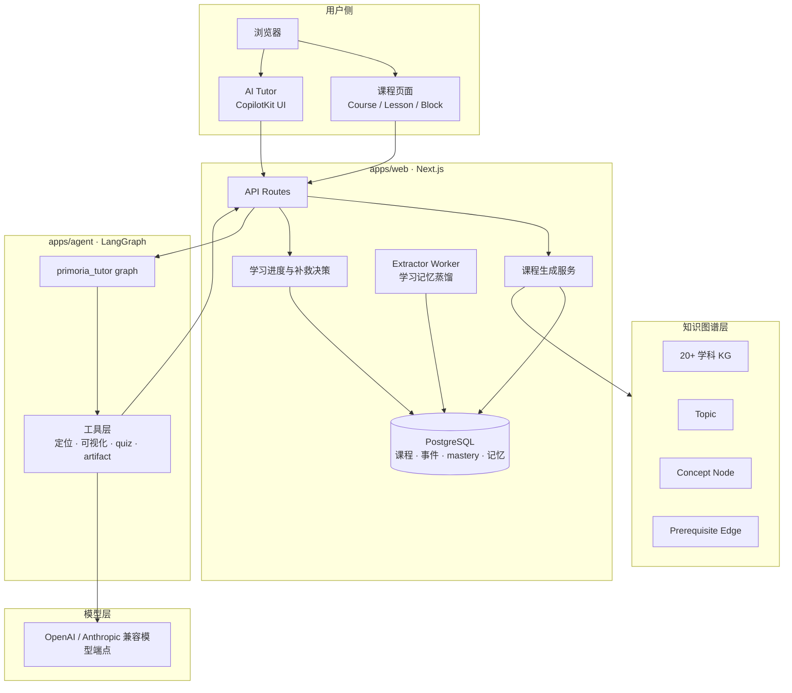

系统设计的关键原则是：**Web 侧负责用户状态和数据库，Agent 侧负责工具编排和智能交互**。Agent 不直接修改数据库，而是通过工具协议把用户意图传回 Web 侧，由 Web 侧完成课程创建、学习状态更新和持久化。

### 3.2 Agent 架构图

下图展示了 Primoria 的 AI Tutor Agent 架构。它不是一个单纯聊天机器人，而是一个可以调用学习定位、课程卡片、可视化规划、交互组件渲染和 quiz 工具的教学 Agent。

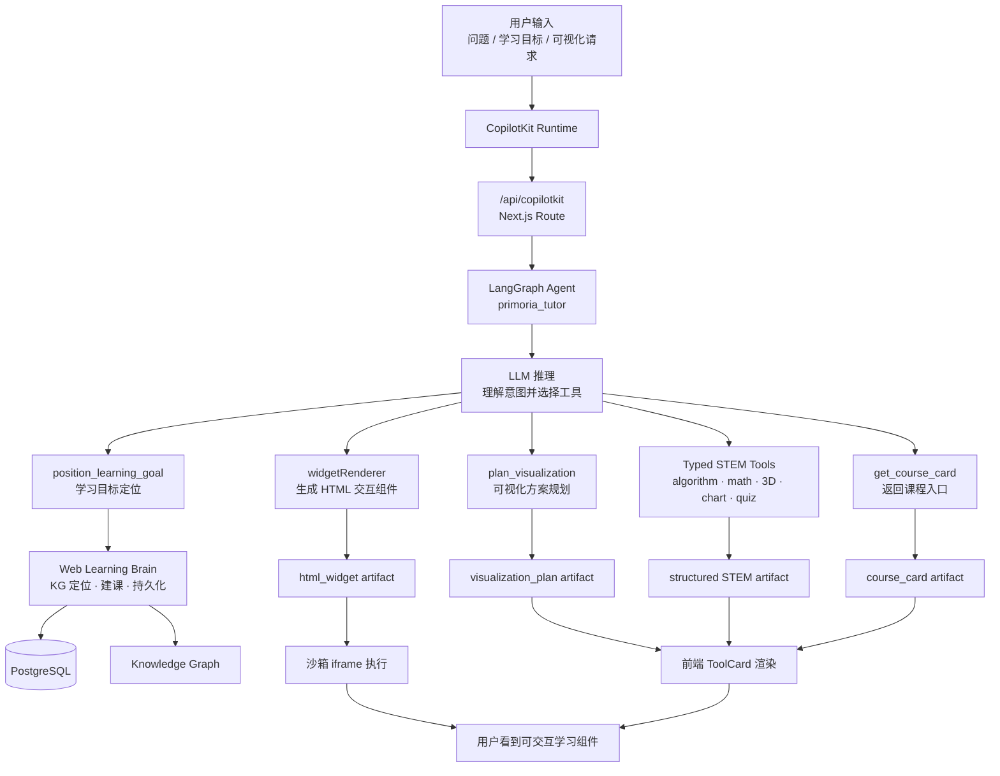

这个架构的优势在于：

- **工具可控**：模型不能任意写入数据库，只能通过定义好的工具表达意图。
- **产物结构化**：前端接收到的是 artifact，而不是不可控的纯文本。
- **教学行为可扩展**：未来可以继续加入新的渲染器、评估器或课程编辑工具。
- **用户状态集中**：课程、mastery、learning events 和 memory 都由 Web 侧统一管理。

### 3.3 课程生成与知识图谱定位

Primoria 的课程生成从知识图谱定位开始。用户输入学习目标后，系统先在多学科 KG 中确定学科和起始 topic，再生成课程大纲与第一节 lesson。

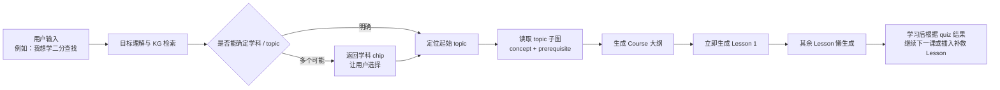

知识图谱层包含：

- `subject`：学科，例如 Calculus、Physics、Data Structures and Algorithms；
- `topic`：学习路径中的章节单位；
- `concept node`：能被 quiz 独立检验的最小概念；
- `prerequisite edge`：先修关系；
- `default_order`：topic 在学科中的默认学习顺序。

课程生成时，lesson 只引用 KG 的 topic / concept ID，不复制整张知识图谱。这样既保证课程内容有稳定结构来源，也方便后续根据用户表现插入补救内容。

### 3.4 Lesson Block 生成

Primoria 的 lesson 不是一整篇长文，而是由多个 block 组成。每个 block 都对应一种教学动作。

| Block 类型 | 作用 |
| --- | --- |
| `text` | 概念解释、hook、roadmap、summary |
| `image` | 静态认知锚点，用于结构识别、场景直觉和类比图像 |
| `visual` | 交互式可视化，用于动态机制、变量关系、过程观察 |
| `quiz` | 每个 concept 的收尾检验 |
| `code` | 编程、算法、软件工程、数值计算等适配主题的代码实践 |
| `transfer` | 融合多个 concept 的迁移应用 |

以两个 concept 的 lesson 为例，系统推荐 13-15 个 block：

```mermaid
flowchart LR
    Hook["Hook"] --> Roadmap["Roadmap"]
    Roadmap --> C1Intro["Concept 1 Intro"]
    C1Intro --> C1Image["Concept 1 Image"]
    C1Image --> C1App["Concept 1 Application"]
    C1App --> C1Visual["Concept 1 Visual"]
    C1Visual --> C1Quiz["Concept 1 Quiz"]
    C1Quiz --> C2Intro["Concept 2 Intro"]
    C2Intro --> C2App["Concept 2 Application"]
    C2App --> C2Image["Concept 2 Image"]
    C2Image --> C2Visual["Concept 2 Visual"]
    C2Visual --> C2Quiz["Concept 2 Quiz"]
    C2Quiz --> Transfer["Transfer"]
    Transfer --> Summary["Summary"]
```

这种结构让课程形成“引入 -> 观察 -> 应用 -> 检验 -> 迁移 -> 总结”的微闭环，避免 AI 课程变成大段文字堆叠。

### 3.5 交互式组件渲染

交互式 visual 是项目的核心体验。模型生成的 HTML/CSS/JS 不会直接插入主页面，而是在沙箱化 iframe 中运行。

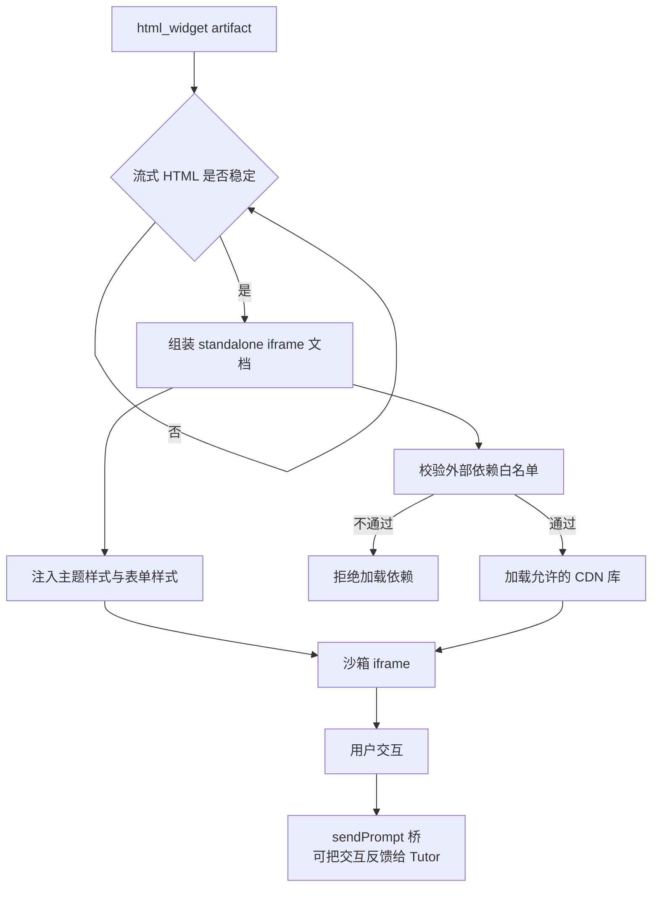

沙箱化设计解决了三个问题：

1. **安全性**：模型生成脚本不会污染主应用。
2. **稳定性**：流式内容稳定后再执行脚本，减少运行时崩溃。
3. **可扩展性**：不同学科可以使用不同可视化库，例如 THREE、Matter.js、d3、Chart.js、p5 等。

### 3.6 学习证据与自适应闭环

Primoria 会记录学习过程中的关键事件，并把它们用于 mastery 更新和下一步课程决策。

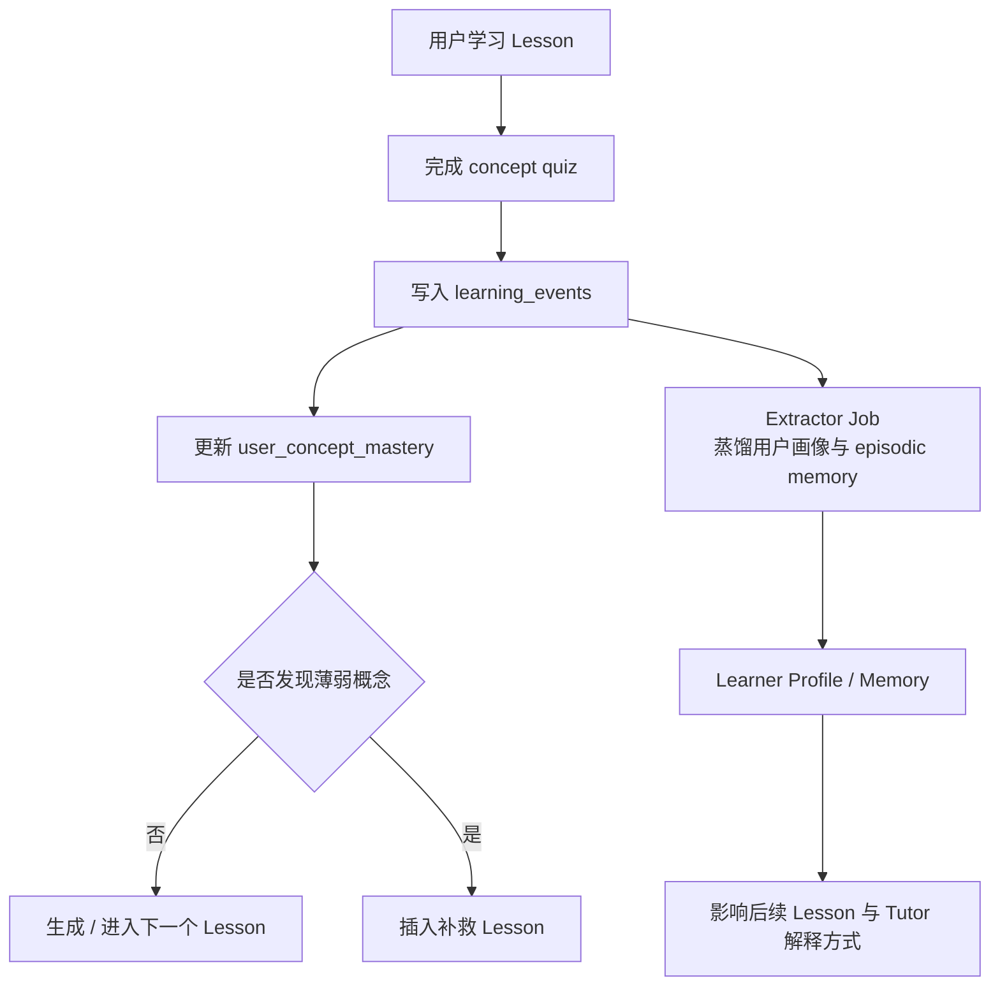

核心数据包括：

| 数据 | 用途 |
| --- | --- |
| `learningEvents` | 记录 quiz、lesson 完成、定位、反馈等学习事件 |
| `quizAttempts` | 保存测验作答结果 |
| `userConceptMastery` | 维护每个 concept 的掌握状态 |
| `learnerProfiles` | 保存用户画像和偏好 |
| `extractorJobs` | 异步蒸馏学习事件，提炼长期记忆 |
| `lessonGenerationJobs` | 管理 lesson 生成任务，支持恢复和重试 |

其中，concept mastery 由 quiz evidence 和规则系统更新，不由 LLM 主观判断。LLM 负责生成内容和提炼语义记忆，评估与补救决策则尽量由结构化证据驱动。

### 3.7 数据库设计

系统采用 PostgreSQL + Drizzle ORM，主要表结构如下：

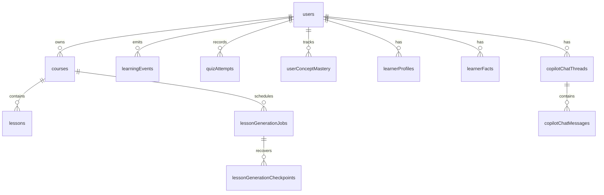

数据库分为几类：

- **身份与会话**：用户、登录身份、会话、设置；
- **课程与 lesson**：course、lesson、课程编辑事件；
- **学习进度**：learning events、quiz attempts、concept mastery；
- **生成任务**：lesson generation jobs、checkpoints；
- **长期记忆**：learner profiles、learner facts、extractor jobs；
- **AI Tutor 对话**：Copilot chat threads、messages；
- **未来工作区基础**：workspace、workspace agents、agent runs、agent memories。

### 3.8 代码结构

```text
primoria/
├─ apps/
│  ├─ web/       Next.js 应用、课程生成、数据库、后台 worker
│  └─ agent/     LangGraph Agent，提供 primoria_tutor 图
├─ packages/
│  ├─ contracts/  Zod schema 与跨运行时类型
│  └─ domain/     不依赖框架的领域逻辑
├─ temple/       知识图谱、构建脚本、校验脚本、产品规格
├─ docs/         架构文档、部署说明、截图
└─ e2e/          端到端测试
```

核心边界是：`apps/web` 与 `apps/agent` 互不直接引用，共享逻辑下沉到 `packages/*`。这种设计可以降低耦合，避免 Agent、前端和数据库层互相穿透。

---

## 4. 项目创新点

### 4.1 从“一次生成”转向“长期学习闭环”

项目不是只生成课程内容，而是把学习目标、课程路径、quiz 证据、mastery、补救 lesson 和长期记忆串成闭环。系统每次学习后都会产生新证据，并影响下一次教学决策。

### 4.2 知识图谱约束课程路径

课程路径不是完全由 LLM 自由生成，而是由 KG 的 topic、concept 和 prerequisite 关系约束。这提高了课程顺序的稳定性，也为自适应补救提供了结构基础。

### 4.3 Agent 工具化而非纯聊天

AI Tutor 通过 LangGraph 调用结构化工具，输出 artifact 给前端渲染。它既能对话，也能创建课程入口、规划可视化、生成交互组件和触发学习定位。

### 4.4 可交互 visual block

系统支持在 lesson 中生成交互式 visual。相比静态文字或图片，visual 可以展示变量关系、动态过程和抽象机制，更适合算法、物理、数学和工程类内容。

### 4.5 证据驱动的 mastery 更新

概念掌握度由 quiz evidence 和规则系统维护，避免模型仅凭用户说“我懂了”就错误判断 mastered。这让评估结果更稳定，也更适合后续自适应决策。

---

## 5. 当前完成度与后续计划

### 5.1 已完成内容

- 完成 monorepo 架构；
- 完成 Next.js Web 应用与 LangGraph Agent 链路；
- 完成 CopilotKit AI Tutor 集成；
- 完成多学科知识图谱基础与 KG 定位流程；
- 完成课程生成、lesson 持久化和 lazy generation 基础；
- 完成沙箱化交互组件渲染；
- 完成 STEM 类型化渲染工具基础；
- 完成 PostgreSQL / Drizzle 数据模型；
- 完成 learning events、quiz attempts、user concept mastery；
- 完成 lesson generation jobs、learning progress jobs、extractor jobs 基础。

### 5.2 正在完善内容

- 提升 lesson block 生成稳定性，确保 image、visual、quiz 和 transfer 更符合教学结构；
- 完善 mastery 更新规则和补救 lesson 插入策略；
- 增强 AI Tutor 对当前 course、lesson、block 和 concept 的上下文理解；
- 提升 iframe 交互组件在不同屏幕和不同主题下的稳定性；
- 推进用户画像与 episodic memory 的蒸馏效果。

### 5.3 后续计划

| 阶段 | 方向 | 目标 |
| --- | --- | --- |
| P0 | 个人学习闭环 | 稳定完成定位、建课、学习、评估、补救和记忆沉淀 |
| P1 | 课堂 / 工作区 | 支持教师、学生、作业、群聊和协作学习 |
| P2 | 多 Agent 协作 | 支持用户自建 Agent、Agent 能力声明和任务执行 |
| P3 | 群体智能 | 基于共享课程、反馈排名和系统级学习形成内容飞轮 |

---

## 6. 附录：产品截图

> 图片位于仓库 `docs/` 目录，以下路径为相对路径。

**当前 Web 应用**

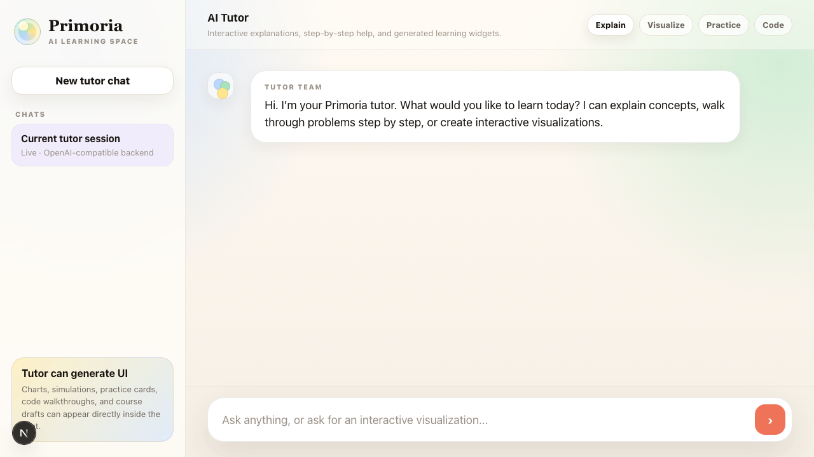

**AI Tutor**

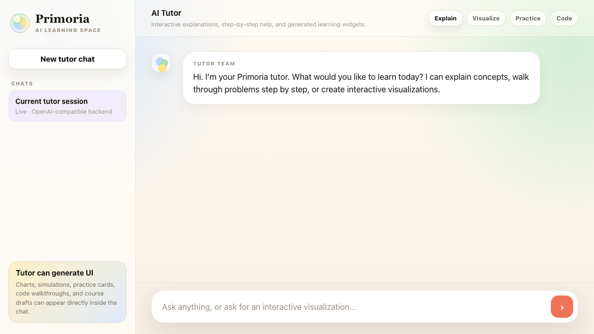

**交互式组件**

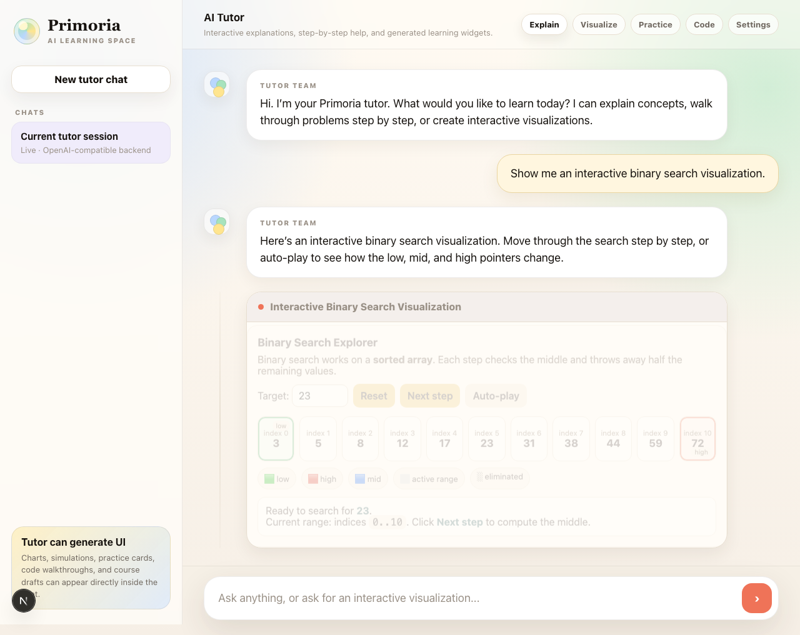

**设置 / 模型供应商配置**

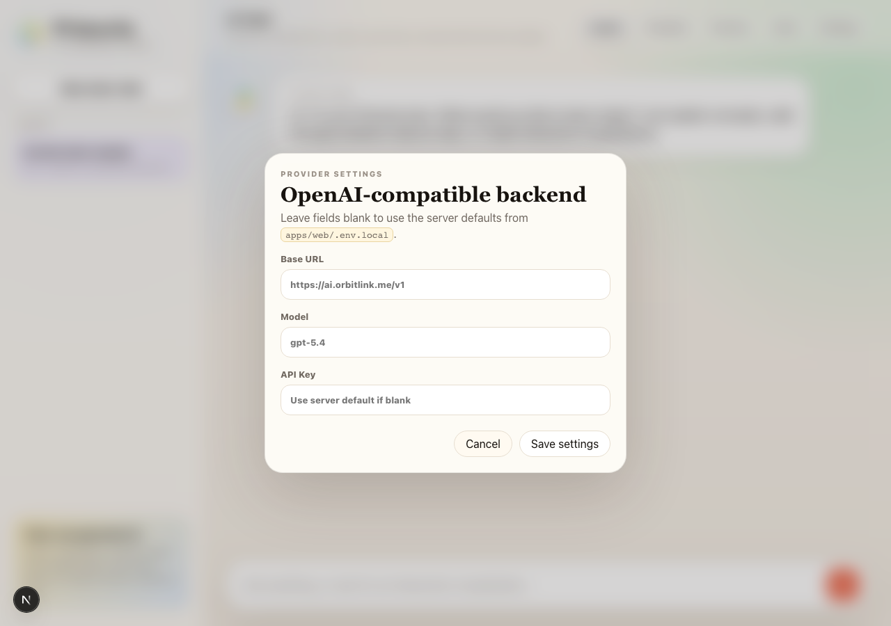

**概念设计：桌面端**

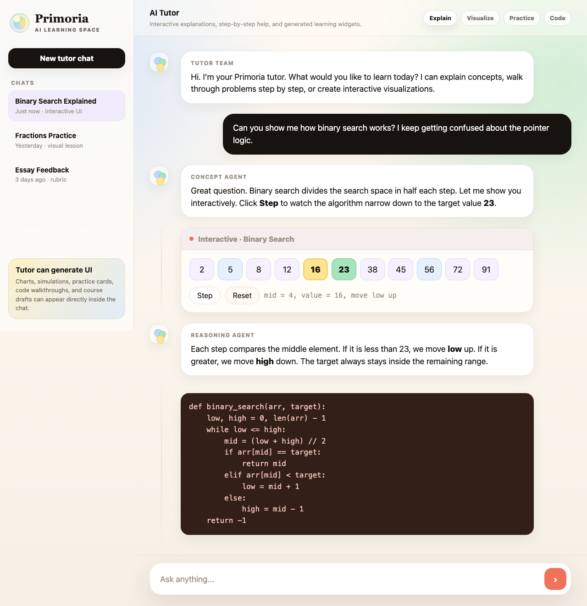

**概念设计：移动端**

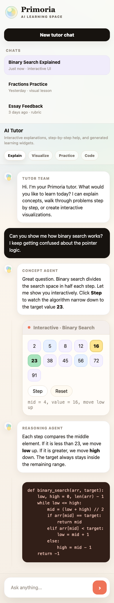

---

*本报告面向比赛评审整理。正式提交前，请补齐学校、课程、作者和指导老师信息，并按比赛要求确认报告格式。*
