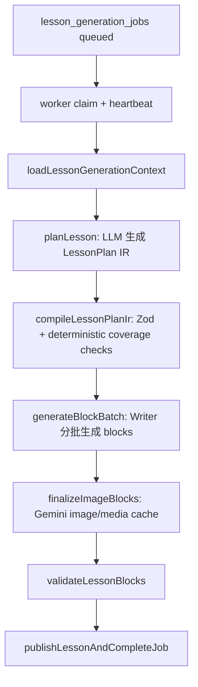

# Course Generation Hardening Follow-ups 4-7

本文档给后续 Coding Agent 使用，目标是处理课程生成审查中的后四个行动项。这里关注 lesson planner 稳定性、generated graph 结构契约、Gemini 图像模型文档、以及 bug 记录整理。

## 背景

课程生成链路当前大致是：



相关文件：

- `apps/web/src/lib/ai/course-generation/lesson-planner.ts`
  - 生成 compact LessonPlan IR。
  - 当前通过 prompt 要求模型输出 JSON。
- `apps/web/src/lib/ai/course-generation/model-json.ts`
  - `invokeJson()` 支持 schema-based structured output，但只有调用方传 `schema` 时才启用。
- `apps/web/src/lib/ai/course-generation/lesson-plan-ir.ts`
  - 定义 `LessonPlanIrSchema`、`decodeLessonPlanIr()`。
  - malformed IR 会抛 `IrParseError`。
- `apps/web/src/lib/courses/lesson-generation-processor.ts`
  - `loadOrCreatePlan()` 调用 `planLesson()`，再调用 `compileLessonPlanIr()`。
  - planner/compile 错误会清理 checkpoint 并交给 job retry。
- `temple/Course Generator BUG.md`
  - 当前记录了 malformed lesson plan IR，例如 `v` 收到 `NaN`、`lesson` 缺失、`blocks` 缺失。
  - 这份 bug 文档目前没有复现输入、根因判断、处理状态。

本轮不处理密码重置和邮件验证。不要把本任务扩展到无关 auth route。

## 行动 4：强化 Lesson Planner 的结构化输出或修复提示

### 当前问题

`Course Generator BUG.md` 记录的错误说明 planner 可能输出 malformed IR：

- `v` 是 `NaN`。
- `lesson` 缺失。
- `blocks` 缺失。

当前 `decodeLessonPlanIr()` 会正确拒绝坏数据，这一点是好的。但当前恢复方式主要依赖 job retry：

- `loadOrCreatePlan()` 生成 raw IR。
- `compileLessonPlanIr()` 失败。
- 清掉 plan/batch checkpoint。
- 把错误分类为 retryable。
- worker 根据 attempt budget 再试。

这比吞错安全，但不是最高效的生成策略。模型如果持续受同一 prompt 影响，重试可能继续生成同类坏 IR。

### 目标行为

优先让模型从源头输出更稳定的结构；其次在第一次 IR parse/coverage 失败时，允许一次有限 repair attempt。

推荐两层方案：

1. 在 `planLesson()` 调用 `invokeJson()` 时传入 `LessonPlanIrSchema` 和 `schemaName`。
2. 如果 `compileLessonPlanIr()` 仍失败，做一次 repair prompt，把错误摘要、原始 IR、目标 schema 要点传给模型，要求只返回修复后的 IR。

### 实现提示

`LessonPlanIrSchema` 已在 `lesson-plan-ir.ts` 中 export。可考虑在 `lesson-planner.ts` 中引入：

```ts
import { LessonPlanIrSchema } from "./lesson-plan-ir";
```

然后：

```ts
return invokeJson({
  system,
  user,
  settings: options.settings,
  schema: LessonPlanIrSchema,
  schemaName: "lesson_plan_ir",
});
```

注意：

- 不要让 repair 无限循环。最多一次 repair，然后再交给现有 job retry。
- repair prompt 不要让模型重写完整 lesson 内容，只修 IR 结构。
- repair 后仍必须走 `compileLessonPlanIr()`，不能信任模型。
- 不要把 compiler 的 coverage 规则下沉给模型作为唯一保障，compiler 仍是最终裁判。

### 测试建议

补充或扩展以下测试：

- structured output path 传入 schema。
- planner 输出 `NaN` 或缺字段时，repair attempt 被触发。
- repair 后仍不合法时，错误继续抛出并清理 checkpoint。
- 不要把坏 IR 静默转成默认课程。

## 行动 5：Generated Graph Parser 强制 2-3 Concepts

### 当前问题

`generated-graph.ts` 的注释和 prompt 明确说：

- 每个 generated topic 应有 2-3 个 concepts。
- 这是为了接近正式 KG 的 topic grain，方便后续沉淀和 promotion。

但 parser 当前只拒绝 0 concept topic：

```ts
if (concepts.length === 0) continue;
```

这意味着 LLM 输出 1 个 concept 的 topic 也会被接受。lesson planner 现在可以处理 1 concept，所以不一定马上崩，但它会降低 generated graph 的质量标准。

### 目标行为

按审查结论和用户要求，parser 应强制 2-3 concepts：

- topic concept 数少于 2：该 topic 不可用。
- topic concept 数超过 3：继续保留前 3 个，这个现有行为可以保留。
- 最终 usable topics 少于 `MIN_TOPICS`：整个 generated graph 返回 `null`。

### 建议修改点

在 `apps/web/src/lib/knowledge-graph/generated-graph.ts` 中增加：

```ts
const MIN_CONCEPTS_PER_TOPIC = 2;
const MAX_CONCEPTS_PER_TOPIC = 3;
```

然后把 parser 判断改成类似：

```ts
if (concepts.length < MIN_CONCEPTS_PER_TOPIC) continue;
```

同时确保注释、prompt、测试一致：

- `SYSTEM_PROMPT` 已写 “EVERY topic has exactly 2 or 3 concepts”，应保留。
- 顶部注释已写 “strictly 2-3 concepts per topic”，应保留。
- `apps/web/tests/out-of-library.spec.ts` 应新增 1-concept topic 被拒绝的测试。
- 如果已有测试依赖 1-concept generated graph，应该改测试数据，不要放宽 parser。

### 不要做的事

- 不要因为 lesson planner 支持 1 concept，就放宽 generated graph 的质量标准。
- 不要把 1 concept topic 自动补第二个假 concept。补假数据会污染 mastery、lesson planning 和未来 promotion。
- 不要只改 prompt 不改 parser。模型输出必须由 parser 约束。

## 行动 6：更新 Gemini 图像模型文档

### 当前问题

代码已统一默认到：

```ts
gemini-3.1-flash-lite-image
```

相关位置：

- `apps/web/src/lib/ai/media/gemini-image.ts`
- `apps/web/src/lib/courses/lesson-generation-processor.ts`
- `apps/web/src/lib/ai/deepagent/course-generator.ts`

但 `README.md` 的环境变量示例仍写：

```bash
GEMINI_IMAGE_MODEL=gemini-3.1-flash-image
```

这会让部署配置和代码默认行为不一致。

### 目标行为

README 应写当前代码默认模型：

```bash
GEMINI_IMAGE_MODEL=gemini-3.1-flash-lite-image
```

并说明：

- 不设置 `GEMINI_IMAGE_MODEL` 时，代码默认使用 `gemini-3.1-flash-lite-image`。
- 如果未来需要更高分辨率或不同成本/质量取舍，可以显式覆盖。
- Lite 模型的输出能力限制应以 Google 官方文档为准；本审查时 Lite 图像模型偏向 1K 输出。

### 验收

修改后确认：

```bash
rg -n "gemini-3\\.1-flash-image|gemini-3\\.1-flash-lite-image|GEMINI_IMAGE_MODEL" README.md apps/web
```

预期：

- README 不再推荐旧默认模型。
- 代码、测试、README 对默认模型表述一致。

## 行动 7：整理 Course Generator BUG 文档和提交卫生

### 当前问题

`temple/Course Generator BUG.md` 目前像是临时粘贴：

- 只有 malformed IR 错误片段。
- 第二条为空。
- 有 trailing whitespace，`git diff --check 63dd8fcc..HEAD` 会报错。
- 没有复现输入、发生入口、当前状态、下一步处理。

这类临时记录对人有用，但对 Coding Agent 容易造成漂移：Agent 可能不知道这是已修、未修、还是只是观察记录。

### 目标格式

建议把文档整理成以下结构：

```md
# Course Generator BUG

## Bug 1: malformed lesson plan IR

### Status
Open

### Symptom
...

### Observed Error
...

### Likely Code Path
- apps/web/src/lib/ai/course-generation/lesson-planner.ts
- apps/web/src/lib/ai/course-generation/lesson-plan-ir.ts
- apps/web/src/lib/courses/lesson-generation-processor.ts

### Expected Behavior
...

### Current Behavior
...

### Proposed Fix
...

### Verification
...
```

### 要写清楚的事实

- 这是 lesson planner 输出 IR 的问题，不是 block writer 内容编译问题。
- 当前 Zod 拒绝 malformed IR 是正确防线。
- 当前缺的是更稳的 structured output / repair path，而不是放宽 schema。
- 不要把 `NaN` coercion 成 0 或默认版本号，这会掩盖模型坏输出。
- 不要用 fallback lesson/block 来绕过 compiler。

### 验收

从仓库根目录运行：

```bash
git diff --check
```

不应再出现 trailing whitespace。

## 总体验收建议

完成行动 4-7 后，至少运行：

```bash
cd apps/web
./node_modules/.bin/tsc --noEmit
./node_modules/.bin/vitest run tests/out-of-library.spec.ts tests/auth-error-handling.spec.ts
./node_modules/.bin/tsx tests/lesson-plan-compiler.unit.ts
./node_modules/.bin/tsx tests/lesson-planner.unit.ts
./node_modules/.bin/tsx tests/image-pipeline.unit.ts
./node_modules/.bin/tsx tests/gemini-image.unit.ts
./node_modules/.bin/tsx tests/media-assets.unit.ts
```

再从仓库根目录运行：

```bash
node --check apps/agent/src/graph.mjs
git diff --check
```

如果改动涉及 lesson worker retry 或 checkpoint 清理，还应跑相关 lesson job 单测：

```bash
cd apps/web
./node_modules/.bin/tsx tests/lesson-generation-jobs.unit.ts
./node_modules/.bin/tsx tests/lesson-generation-processor.unit.ts
```

