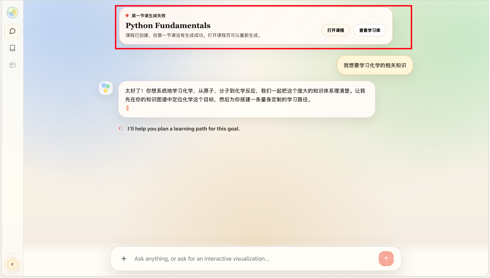
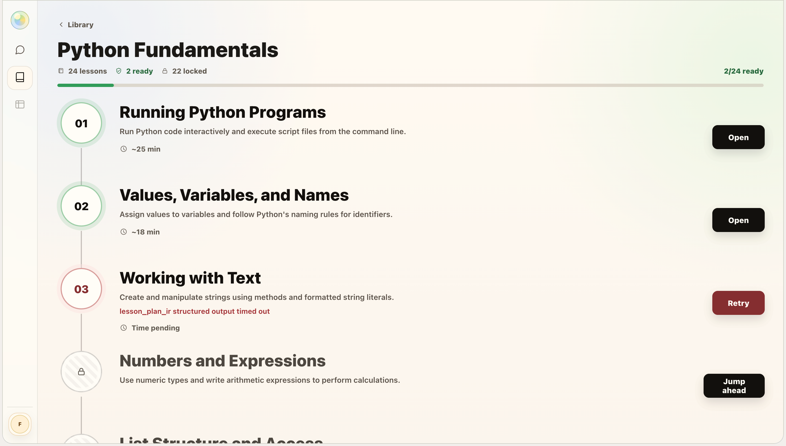
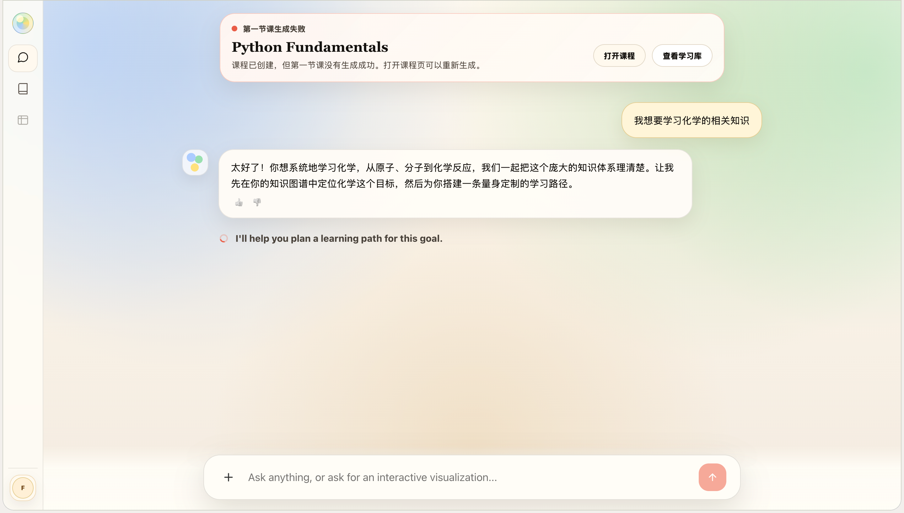
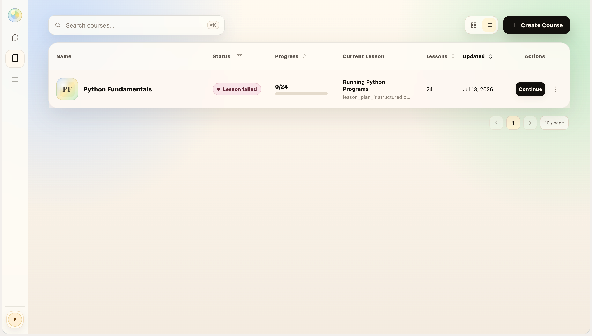

1.  这里的课程生成失败弹窗有如下问题 1. 只要是失败了就一直悬浮,只要我在首页里面就存在,应该弹出一次后切换页面或者开启新聊天就应该消失 2.这里提示第一节课生成失败, 实际上应该是 第三节课: Working With Text生成失败,这里的文字应该做成动态的,根据失败的课程来显示,而不是固定的第一节课生成失败
2.  我这里已经触发建课,但是在library页面里面还是没有对应的课程显示
3. 触发建课后卡在这里很久,至少5分钟,如果有问题也不报错